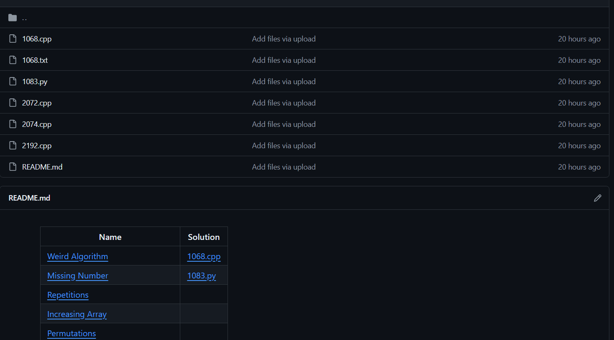

# cses-crawler

A mini tool to download all accepted submissions from [cses.fi](https://cses.fi). If you find any bugs, feel free to create an issue!

## Features
- Download all accepted submissions from multiple accounts
- Automatically create a markdown file containing all problems and links to corresponding submissions, if they exist



## Usage

### Install the prerequisites

```
pip install requirements.txt
```


### Download

First, add accounts to `main.py` by editing the `users = [['', '']]` line. For example, `users = [['some_random_user_1', 'some_random_password_1'], ['random_user_2', 'nonsense_password_3']]`.

Next, execute the program by running `python main.py`.

## Credit

This code is a combination of [this gist](https://gist.github.com/RealA10N/65ecca71cfb46fc9de4ddb05b2d36369) and [this repo](https://github.com/mbfibat/cses-solution).